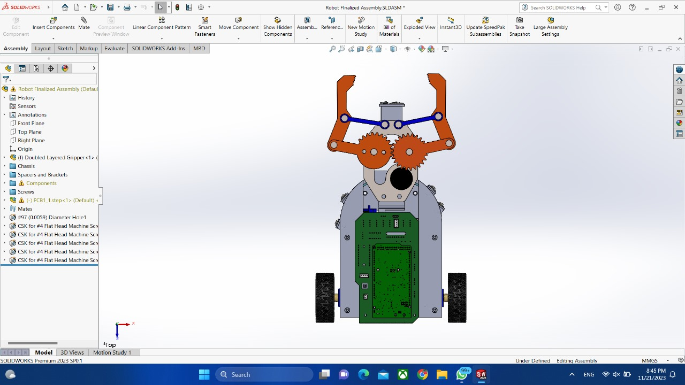
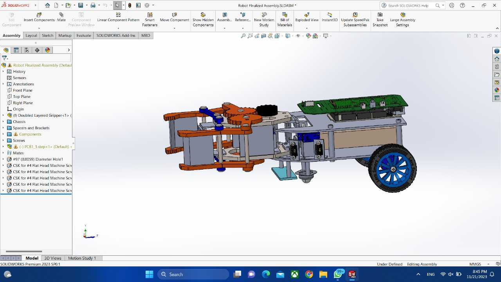
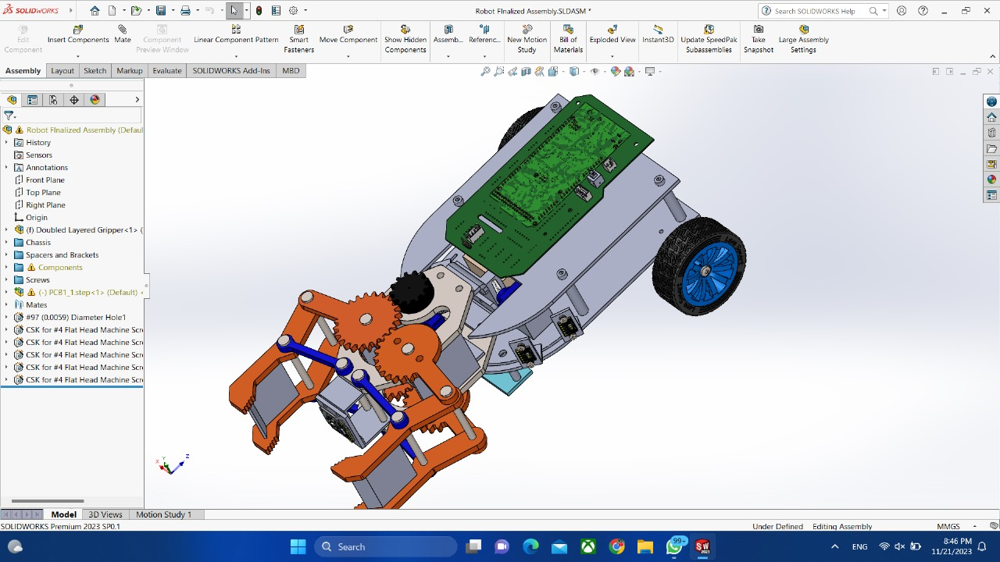
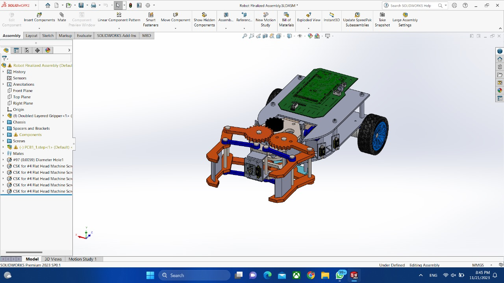
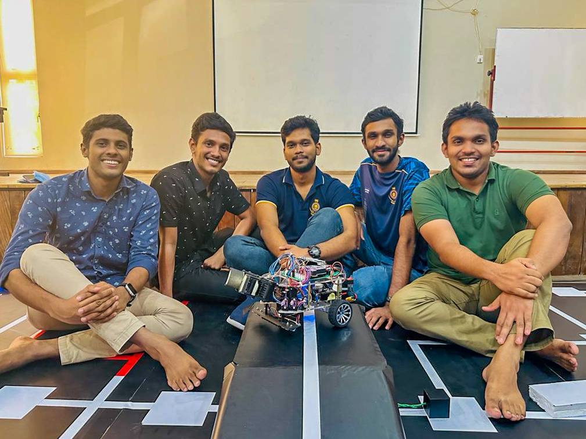

🤖 Exciting Robotics Journey: EN2533 Module Conquered 🚀

 EN2533 Robot Design and Competition module in third 🌟 My team and I navigated through a spectrum of challenges, showcasing our technical prowess and innovative solutions.

🏁 Task Highlights:
1. **Line Following and Obstacle Avoidance:** Our robot seamlessly maneuvered through a predefined path, effortlessly tackling twists and turns while avoiding obstacles.
2. **Ramp Navigation & Box Dragging:** Witness our robot's prowess as it conquered ramps and cleared paths by intelligently dragging a box, demonstrating adaptability and problem-solving skills.
3. **Sound Detection Task:** A cutting-edge feature enabled our robot to respond to sound cues, showcasing precision in halting its movements when needed.

🛠️ Fully Equipped Robot:
Our creation boasts an array of sensors and a touch screen interface for seamless control. The incorporation of advanced technologies has rendered our robot powerful, versatile, and ready for any challenge.

👥 Team Collaboration:
A heartfelt thanks to my incredible team for their dedication and collaborative spirit. Each member's unique skills contributed to the success of our robot.

🚀 Key Learnings:
- The importance of adaptability and problem-solving in robotics.
- Leveraging advanced sensors and technology for enhanced performance.

🌐 Excited for the Future:
As we step into the professional realm, these experiences will undoubtedly shape our engineering endeavors. Looking forward to applying these skills and innovations in future projects.

Solid Work Designs

PCB Designs

Final Robot

Team

